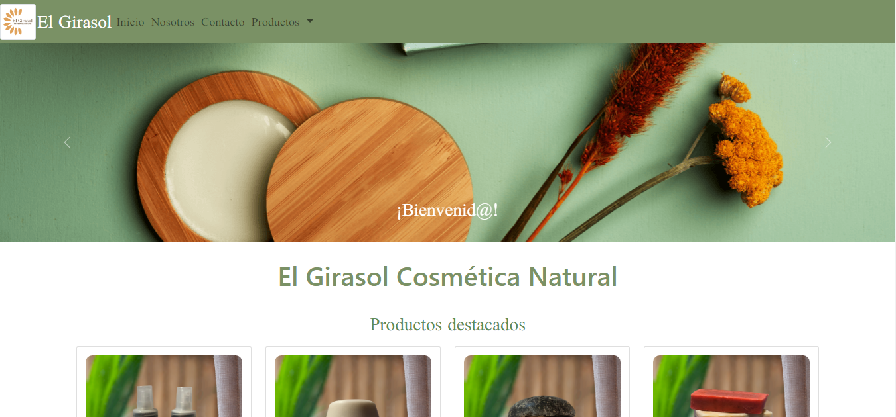
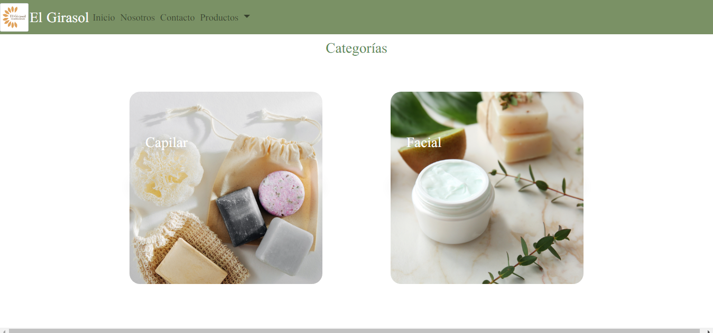

## TiendaElGirasol

This is a student project done as a final assigment, in wich join all the technologies learned at Coder House.

## About

This project is an HTML and CSS demo. It shows diferent products, redirect the client to the e-commerce to buy each product and to the diferent comunication sites that the small bussines has.
---

- <a href="https://naicolqui.github.io/TiendaElGirasol/index.html">Deployment link<a>

## Project Objetives

- Build a HTML web from scratch
- Afirm and conect all the learned concepts in the Carreer 
- Use scrum agile methodology
- learn good programming practices

## Stack of Technologies

### Front End:
HTML, CSS

### Database:
PostgreSQL.

<h2>Here are some screenshots:</h2>

